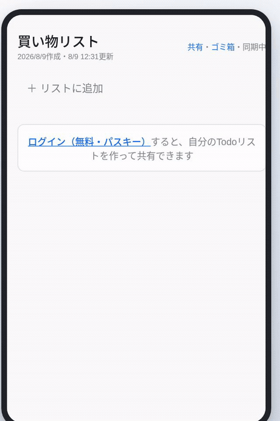
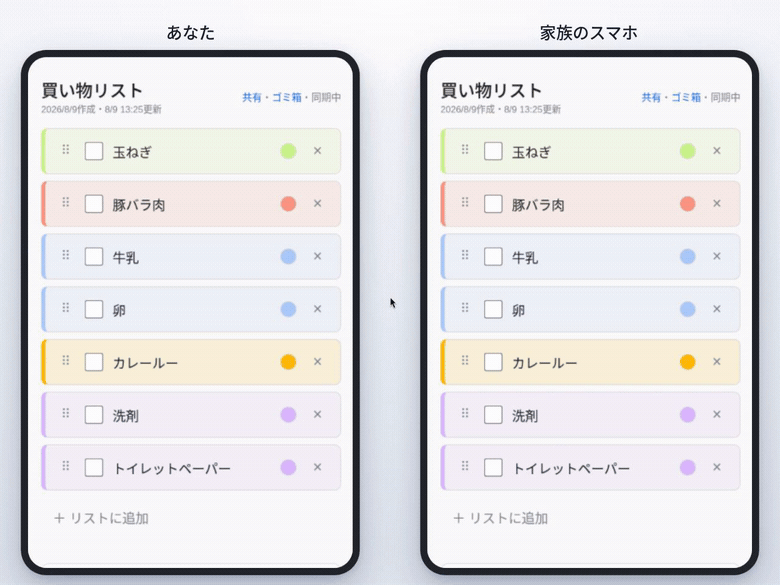

# Shared Todo

AIエージェントと家族で共有できる、買い物・Todoリスト。

**https://shared-todo.abe00makoto.workers.dev**

Google Keep のリスト機能を置き換えるつもりで作った、URL共有型のTodoアプリ。
Cloudflare Workers + Durable Objects で動いていて、開いている全員の画面がリアルタイムに同期する。

## 2つの売り

### 1. AIに言うだけでリストができる（MCP）

MCPトークンを Claude Code などのAIクライアントに登録すると、AIが同じリストを直接読み書きする。

```
「牛乳ない、卵もない、あと洗剤も。リストに足していって」
「スーパーの売り場順に並べ替えて」
「野菜・肉・日用品で色分けして」
「買い物リストに何が残ってる？」
```

冷蔵庫を見ながら言うだけでリストができ、最後に並べ替えと色分けを頼めば、
売り場を行ったり来たりしない買い物リストになる。




### 2. スーパーで手分けして買える（リアルタイム同期）

チェックは全員の画面にその場で反映される。「こっちは野菜、そっちは日用品」と分かれても、
誰かがカゴに入れた瞬間にリストから消えるので、同じものを2つ買ってしまうことがない。
他の人が触った行は一瞬光るので、いま誰が動いているかも分かる。



> どちらも実際のアプリを録画したもの。紹介動画の作り方は [promo/](promo/) を参照。


## 使い方

1. **パスキーで登録** — 表示名を入れるだけ。端末の指紋・顔認証で登録でき、メールアドレスもパスワードも要らない
2. **リストを作る** — 「日用品」「実家用」など用途ごとにいくつでも
3. **共有する** — リスト横の「共有URL」をLINEなどで送るだけ。**受け取った人はログイン不要**で追加・チェック・編集できる

アカウントが要るのはリストを作る人だけ。参加者はURLを開けばそのまま使える。

### その他の機能

| 機能 | 説明 |
|---|---|
| インライン編集 | 行に直接入力して Enter で次の行。モーダルも画面遷移もない |
| チェックの遅延移動 | チェックした項目は3秒その場に残ってから「チェック済み」へ移動。押し間違えてもすぐ戻せる |
| 色分け | 項目ごとに色を付けられる（種類別の仕分けに便利） |
| 並べ替え | ⠿ をドラッグして順番を入れ替え |
| ゴミ箱 | 削除した項目は30日残り、いつでも復元できる |
| 変更履歴・復元 | 作成者はリスト全体を過去の世代に戻せる。AI経由の変更は「AI」として記録される |

## MCP連携のセットアップ

1. ログインして、マイリスト下部の **「MCPトークン発行」** を押す
2. 使うツールのタブ（Claude Code / Gemini CLI / JSON設定）を選び、表示されたコマンドをコピー
3. 手元のターミナルで実行する

Claude Code の場合はこの形になる:

```bash
claude mcp add --scope user --transport http shared-todo \
  https://shared-todo.abe00makoto.workers.dev/api/mcp \
  --header "Authorization: Bearer <発行されたトークン>"
```

トークンは発行時にしか表示されない。漏れた場合はマイリストから「無効化」すればそのトークンは使えなくなる。

### 提供ツール

| 分類 | ツール |
|---|---|
| リスト | `list_todo_lists` `create_todo_list` `delete_todo_list` `get_share_link` |
| 項目の取得・追加 | `get_items` `add_items` `update_item` |
| チェック | `check_item` `uncheck_item` `check_items` `uncheck_items` |
| 削除・復元 | `delete_item` `get_trash` `restore_items` |
| 並べ替え・色 | `move_item` `reorder_items` `set_item_colors` |

MCP経由の変更も他のクライアントと同じ Durable Object を通るので、
AIが書き込んだ内容はスマホで開いている画面にも即座に反映される。

## 開発

```bash
pnpm install
pnpm db:migrate:local   # ローカルD1にマイグレーション適用
pnpm dev                # http://localhost:7642
```

`.dev.vars` に `SESSION_SECRET` が必要（本番は `wrangler secret` で管理）。

| コマンド | 内容 |
|---|---|
| `pnpm dev` | 開発サーバ（フロント + Worker が同時に起動、HMR対応） |
| `pnpm build` | 本番ビルド |
| `pnpm typecheck` | 型チェック |
| `pnpm db:generate` | スキーマ変更からマイグレーション生成 |
| `pnpm db:migrate:local` / `pnpm db:migrate` | マイグレーション適用（ローカル / 本番） |
| `pnpm deploy` | 手動デプロイ（通常は不要、下記参照） |

### デプロイ

`main` に push すると Cloudflare Workers Builds が自動でビルド・デプロイする。手動デプロイは基本不要。

### 構成

```
src/
├── client/          React フロントエンド
│   ├── Home.tsx         トップ（説明・パスキー認証・マイリスト・MCPトークン発行）
│   ├── ListPage.tsx     リスト画面（インライン編集・履歴・ゴミ箱）
│   └── useListSocket.ts WebSocket 接続と楽観更新
├── worker/          Cloudflare Worker（Hono）
│   ├── index.ts         HTTP API・ルーティング
│   ├── auth/            パスキー（WebAuthn）認証・セッション
│   ├── do/list-room.ts  Durable Object（1リスト = 1 DO、WebSocket をここに束ねる）
│   ├── mcp/             MCP エンドポイント（/api/mcp）
│   └── db/schema.ts     Drizzle スキーマ（D1）
└── shared/          クライアント・Worker 共通の型（WebSocketプロトコル等）
```

**技術スタック**: Hono / Cloudflare Workers / D1 / Durable Objects / React 19 / Vite / Drizzle ORM / SimpleWebAuthn

リアルタイム同期は「1リスト = 1 Durable Object」に WebSocket を束ねる構成で、
Hibernation API により接続がアイドルの間はコストがかからない。

詳しい要件と設計は [docs/requirements.md](docs/requirements.md) / [docs/design.md](docs/design.md) を参照。
